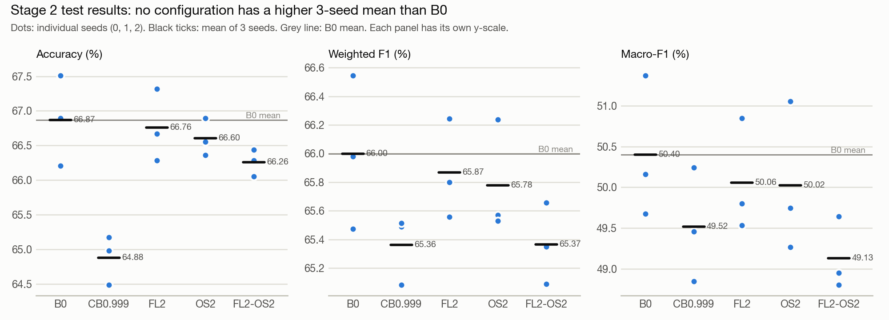
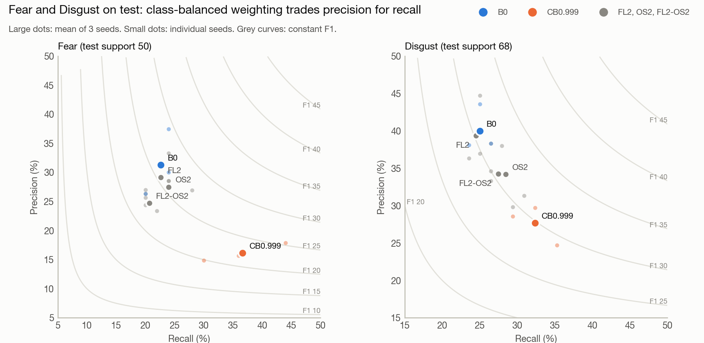
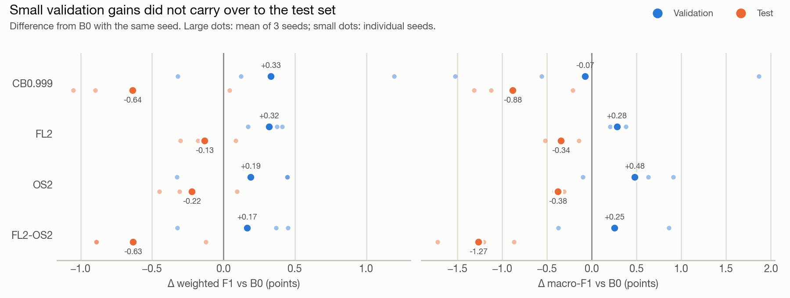

# Limitation 2: Class Imbalance on MELD — Experiment Report

**Author:** Keshav Mishra (Person B, *ECERC Revisited* course project)
**Experiments run:** October 2026, Google Colab (NVIDIA Tesla T4)
**Code:** [`MELD/train_imbalance.py`](../MELD/train_imbalance.py), [`MELD/analyze_imbalance.py`](../MELD/analyze_imbalance.py)
**Raw evidence:** [`notebooks/`](../notebooks/) (executed Colab notebooks) and [`results/`](../results/) (saved metrics and summaries)

---

## Summary

ECERC reaches about 67% accuracy on MELD, but its two rarest emotions, Fear and Disgust, stay below 33% F1. I tested three standard ways of countering class imbalance, plus one combination, under a fixed protocol:

- class-balanced loss weights (CB);
- a stronger focal exponent (FL);
- oversampling of dialogues that contain Fear or Disgust (OS);
- focal loss combined with oversampling (FL2-OS2).

Each of the five configurations (including the baseline) was trained with three seeds, and configurations were selected on validation only.

**On the held-out test set, no configuration improved on the original ECERC objective (B0) in mean accuracy, weighted F1 or macro-F1.** Every variant had lower test macro-F1 than B0 on every one of the three seeds.

- **Class-balanced weighting** raised Fear and Disgust recall but lowered their precision by more. Its extra minority predictions were too often wrong for F1 to rise.
- **FL2 and OS2** stayed within about 0.4 points of B0 on every overall metric.
- **OS2** gave the only nominal gain on a minority-class F1: Disgust, +0.22, well inside seed variation.

Several variants looked slightly better than B0 on validation, but none of those gains held on test. I report this as a negative result.

---

## 1. Background

### 1.1 ECERC

ECERC ([Zhang & Tan, ACL 2025](https://aclanthology.org/2025.acl-long.102/)) is a multimodal emotion-recognition-in-conversation model. It processes each utterance in four steps:

1. It gates text, audio and visual *evidence* against each other.
2. It encodes the evidence and a semantic *cause* representation with self-attention.
3. It models four kinds of evidence-cause interaction with masked cross-attention: self-event, cross-event, self-contagion and cross-emotion.
4. It gates and concatenates the four resulting features before a linear classifier.

This repository uses the authors' code and released checkpoint unchanged. See [`upstream_README.md`](upstream_README.md).

### 1.2 The imbalance problem on MELD

MELD has seven emotion classes, and Fear and Disgust together make up less than 6% of every split. Utterance counts, as printed by `train_imbalance.py --dry_run` ([notebook 02](../notebooks/02_stage0_retrain_and_stage1_pilot.ipynb)):

| split | dialogues | utterances | Neutral | Surprise | **Fear** | Sadness | Joy | **Disgust** | Anger |
|---|---|---|---|---|---|---|---|---|---|
| train | 1038 | 9989 | 4710 | 1205 | **268** (2.68%) | 683 | 1743 | **271** (2.71%) | 1109 |
| valid | 114 | 1109 | 470 | 150 | **40** (3.61%) | 111 | 163 | **22** (1.98%) | 153 |
| test | 280 | 2610 | 1256 | 281 | **50** (1.92%) | 208 | 402 | **68** (2.61%) | 345 |

The released ECERC checkpoint scores 29.27 F1 on Fear and 32.08 on Disgust, against 79.94 on Neutral (§4.1). Limitation 2 of the project asks whether standard imbalance techniques can close part of that gap without hurting overall accuracy.

### 1.3 Project context

This work is one part of the three-person course project *ECERC Revisited*. The project keeps the ECERC backbone fixed and studies three limitations, one per team member:

1. a confusion-aware contrastive regularizer;
2. class imbalance on MELD (**this repository; Person B**);
3. confidence-aware cause gating.

Components 1 and 3 and the combined ablation are not part of this repository.

---

## 2. Configurations

Every configuration uses the same model, features, optimizer and schedule as the upstream `MELD/train.py`:

- Adam with lr 1e-5 and weight decay 2e-4;
- batch size 32;
- 40 epochs, with patience 20 on both validation weighted F1 and validation loss.

Each configuration changes exactly one thing, or two for FL2-OS2.

| Name | What changes relative to B0 | Command |
|---|---|---|
| **B0** | Nothing. This is the original ECERC MELD objective: upstream `Loss(gamma=1, alpha=None)`, a **focal loss with γ = 1** applied to log-probabilities, and a shuffled training loader. | `--seed S` |
| **CB0.999** | Class-balanced weights (Cui et al., 2019; effective number of samples, β = 0.999) **applied as per-class α inside the same γ = 1 focal loss**. This is not plain cross-entropy. Weights come from training-split counts only and are rescaled so that the mean weight per training utterance is 1. | `--cb_beta 0.999` |
| **FL2** | Focal exponent changed **from γ = 1 to γ = 2**, with no class weights. | `--gamma 2` |
| **OS2** | **Training sampling strategy changed.** Dialogues containing at least one Fear or Disgust utterance (315 of 1038) are drawn with weight ρ = 2 and all others with weight 1. 1038 dialogues are drawn per epoch with replacement. The loss is unchanged. | `--oversample --os_rho 2` |
| **FL2-OS2** | FL2 and OS2 together. | `--gamma 2 --oversample --os_rho 2` |

The class-balanced weights for β = 0.999, as printed by the dry run:

| | Neutral | Surprise | Fear | Sadness | Joy | Disgust | Anger |
|---|---|---|---|---|---|---|---|
| weight | 0.725 | 1.026 | 3.055 | 1.452 | 0.871 | 3.026 | 1.072 |

**How OS2 changes the training mix.** The expected share of training utterances goes from 2.68% to 3.84% for Fear and from 2.71% to 3.88% for Disgust (from the dry run). Because the sampler draws with replacement, a dialogue can appear several times in one epoch or not at all. With total weight 315 × 2 + 723 = 1353 and 1038 draws, the expected fraction of dialogues that are *not* drawn in a given epoch is:

- (1 − 1/1353)^1038 ≈ 46% for weight-1 dialogues;
- (1 − 2/1353)^1038 ≈ 21% for weight-2 dialogues.

These are analytic expectations from the sampler's definition, not measured values. Each B0 epoch, by contrast, visits every training dialogue exactly once.

**Kept identical across all configurations:**

- **Validation and test loss** are always computed with the B0 loss, `Loss(gamma=1, alpha=None)`, so early stopping compares like with like.
- **The reported checkpoint** is the epoch with the best validation weighted F1 (first maximum), exactly as in upstream `train.py`.
- **Validation and test loaders** are sequential and unweighted. The script checks this at start-up.

**Inherited from upstream and deliberately left unchanged:**

- **Test evaluated every epoch.** Upstream `train.py` evaluates the test set at every epoch and prints it. `train_imbalance.py` keeps that logging so that B0 can match `train.py` exactly (§4.2). Test results were therefore computed and logged for every run, but **the test set was not used for model or configuration selection**. Checkpoint selection used validation weighted F1, and the pilot used validation macro-F1.
- **Audio/visual slot order.** The MELD dataloader returns the visual features in the slot the model treats as audio, and vice versa. All runs, B0 included, keep this order, because the released checkpoint was trained with it.

---

## 3. Protocol and environment

The experiment had three stages:

| Stage | Purpose | Runs | Split used for decisions |
|---|---|---|---|
| **0** | Check that the released checkpoint and the retrained baseline behave as expected in my environment | R0 (checkpoint evaluation), upstream `train.py` seed 0, B0 seed 0 | none (verification only) |
| **1** (pilot) | Choose β for CB and ρ for OS | CB β ∈ {0.999, 0.9999}, OS ρ ∈ {2, 4}, FL γ = 2; seed 0 | validation macro-F1 |
| **2** (final) | Compare the five configurations | 5 configurations × seeds {0, 1, 2} = 15 runs | none: all 15 are reported |

**Environment.** All runs used Google Colab with an NVIDIA Tesla T4 and the following software (printed in the notebooks):

- Python 3.13.15;
- PyTorch 2.11.0+cu130 (CUDA 13.0);
- NumPy 2.1.3, scikit-learn 1.6.1, pandas 2.2.3.

**This differs from the upstream environment:**

- `requirement.yml` pins Python 3.9.1, PyTorch 2.0.1 (CUDA 11.8 build), NumPy 1.25.0 and scikit-learn 1.3.2;
- `OS_info.txt` records Windows 10, an NVIDIA A100 80GB, CUDA 11.4 and cuDNN 8.2.4.

Absolute numbers may therefore differ slightly from what the authors' environment would produce.

**Determinism in this environment.** Upstream `seed_everything` with `cudnn.deterministic = True` made runs repeatable on the T4. B0 seed 0, and the seed-0 runs of CB0.999, FL2 and OS2, were each run twice in separate Colab sessions (notebooks 02 and 03). For each pair:

- the printed results are identical: the same selected epoch and the same validation and test metrics;
- the saved `metrics.json` and prediction files are byte-identical;
- the per-epoch log is identical apart from wall-clock time.

See [`results/README.md`](../results/README.md).

**Metrics.** All metrics are percentages:

- accuracy, weighted F1 and macro-F1 over the 7 classes;
- per-class precision, recall and F1 (scikit-learn);
- "± x" is the **sample standard deviation over 3 seeds**.

With three seeds, no significance tests were run, and the standard deviations themselves are imprecise.

---

## 4. Stage 0: Baseline verification

Evidence: [notebook 01](../notebooks/01_stage0_released_checkpoint.ipynb) and the first part of [notebook 02](../notebooks/02_stage0_retrain_and_stage1_pilot.ipynb).

### 4.1 R0: the released checkpoint

R0 is the authors' released `MELD/ECERC_MODEL.pkl` (SHA-256 `0f44a6e5…`), evaluated without training. I evaluated it with the upstream `inference.py` (notebook 01) and with `train_imbalance.py --eval_only` (notebooks 02 and 03). All three evaluations agree.

| | Acc | wF1 | macro-F1 | Fear F1 | Disgust F1 |
|---|---|---|---|---|---|
| R0, test | 67.55 | 66.58 | 51.36 | 29.27 | 32.08 |
| R0, validation | 67.00 | 65.88 | 54.42 | 30.77 | 42.11 |
| *Paper (Table 3; average over 3 runs), test* | *67.32* | *66.46* | — | — | — |

R0 is **one** checkpoint. According to the upstream README, the paper's figures are an average over 3 runs. The authors released three checkpoints (`ECERC_MODEL`, `_2`, `_3`), and `_2` and `_3` were not evaluated here. R0 is therefore a check of the released checkpoint in my environment, **not a reproduction of the paper's 3-run average**.

### 4.2 B0 seed 0 and the equivalence check

I trained the upstream `MELD/train.py` (seed 0) and `train_imbalance.py` with no options (B0, seed 0) in the same session. Then `analyze_imbalance.py compare` checked their per-epoch logs:

```
A: results/orig_train_s0.log (40 epochs)
B: results/B0_s0 (40 epochs)
field           epochs differing   max |A-B|
epoch                          0           0
train_loss                     0           0
train_acc                      0           0
train_fscore                   0           0
valid_loss                     0           0
valid_acc                      0           0
valid_fscore                   0           0
test_loss                      0           0
test_acc                       0           0
test_fscore                    0           0
A: best valid wF1 at epoch 35 -> test acc 67.51 / wF1 66.54; lowest valid loss at epoch 39 -> test acc 67.2 / wF1 66.29
B: best valid wF1 at epoch 35 -> test acc 67.51 / wF1 66.54; lowest valid loss at epoch 39 -> test acc 67.2 / wF1 66.29
RESULT: IDENTICAL. All 40 epochs match exactly.
```

(Verbatim output of `python analyze_imbalance.py compare results/orig_train_s0.log results/B0_s0`, notebook 02.)

The check shows that `train_imbalance.py` without options reproduces upstream `train.py` exactly in this environment. It does not show agreement with the authors' A100 environment. A `sha256sum -c` check after these runs confirmed that the five upstream MELD files and the checkpoint were unmodified.

| B0 seed 0 (epoch 35, best validation wF1) | Acc | wF1 | macro-F1 | Fear F1 | Disgust F1 |
|---|---|---|---|---|---|
| test | 67.51 | 66.54 | 51.37 | 29.27 | 31.78 |
| validation | 67.00 | 65.88 | 54.68 | 33.33 | 42.11 |

On test, B0 seed 0 is within 0.04 points of R0 on accuracy and weighted F1.

---

## 5. Stage 1: Pilot (validation only)

Evidence: second part of [notebook 02](../notebooks/02_stage0_retrain_and_stage1_pilot.ipynb), where the pilot summary and choice are printed in cells 35 and 39 and the record in cell 40. No Stage 1 files are saved in [`results/`](../results/): the pilot summary folder and record were not part of the exported results. The seed-0 CB0.999, FL2 and OS2 pilot runs reappear as the seed-0 rows of the Stage 2 summaries (§6).

**Design.**

- **Settings tested:** CB β ∈ {0.999, 0.9999} and OS ρ ∈ {2, 4}, each with seed 0. FL with γ = 2 was run too.
- **γ was not tuned.** γ = 2 was fixed in advance as the focal-loss setting, so the pilot only checked that it trained normally.
- **Selection rule:** within each family (CB, OS), choose the setting with the highest validation macro-F1. If two settings are within 0.5 points, choose the milder one.
- **The rule was fixed before the pilot.** It is implemented in `analyze_imbalance.py`, whose SHA-256 was printed in notebook 02 before any pilot run and matches the file in this repository.

**Pilot results (validation, seed 0).** B0 seed 0 from Stage 0 is shown for reference.

| run | epoch | Acc | wF1 | macro-F1 | Fear P / R / F1 | Disgust P / R / F1 |
|---|---|---|---|---|---|---|
| *B0 (reference)* | *35* | *67.00* | *65.88* | *54.68* | *42.31 / 27.50 / 33.33* | *50.00 / 36.36 / 42.11* |
| CB β=0.999 | 35 | 65.83 | 66.00 | **53.16** | 25.86 / 37.50 / 30.61 | 25.00 / 40.91 / 31.03 |
| CB β=0.9999 | 19 | 63.66 | 64.57 | 51.89 | 25.42 / 37.50 / 30.30 | 18.18 / 45.45 / 25.97 |
| FL γ=2 | 36 | 67.27 | 66.05 | 54.89 | 40.74 / 27.50 / 32.84 | 53.33 / 36.36 / 43.24 |
| OS ρ=2 | 32 | 67.09 | 66.32 | **55.32** | 33.33 / 30.00 / 31.58 | 47.37 / 40.91 / 43.90 |
| OS ρ=4 | 32 | 67.18 | 66.36 | 54.15 | 34.29 / 30.00 / 32.00 | 32.14 / 40.91 / 36.00 |

**Choices**, as printed by the analyzer:

- CB: β = 0.999 (53.16 vs 51.89);
- OS: ρ = 2 (55.32 vs 54.15).

Together with the pre-fixed γ = 2, these define the Stage 2 configurations.

**Notes:**

- **The pilot chose a setting within each family; it did not decide whether a family continued.** Both CB settings scored below B0's validation macro-F1 at seed 0. CB still went to Stage 2 with its better β.
- **Test metrics were logged** for the pilot runs, since every run logs them (§2), but they played no part in the choices above.

---

## 6. Stage 2: Final experiment

Evidence: [notebook 03](../notebooks/03_stage2_final_experiment.ipynb). Outputs: [`results/stage2/`](../results/stage2/).

Five configurations × seeds 0, 1, 2 = **15 runs**, all reported. Each run is scored at its own best-validation-wF1 epoch. Some seed-0 runs repeat earlier runs:

- B0 seed 0 is a deterministic re-run of the Stage 0 run.
- The seed-0 runs of CB0.999, FL2 and OS2 are re-runs of the Stage 1 pilot runs, with identical printed metrics.

Their seed-0 validation numbers were therefore already known when β and ρ were chosen. The test results were not involved in that choice.

### 6.1 Test results

| Configuration | Accuracy | Weighted F1 | Macro-F1 | Fear F1 | Disgust F1 |
|---|---|---|---|---|---|
| **B0** | **66.87 ± 0.65** | **66.00 ± 0.54** | **50.40 ± 0.87** | 26.22 ± 3.29 | 30.72 ± 1.43 |
| CB0.999 | 64.88 ± 0.36 | 65.36 ± 0.24 | 49.52 ± 0.70 | 22.37 ± 2.82 | 29.69 ± 1.13 |
| FL2 | 66.76 ± 0.52 | 65.87 ± 0.35 | 50.06 ± 0.69 | 25.49 ± 2.77 | 30.16 ± 1.78 |
| OS2 | 66.60 ± 0.27 | 65.78 ± 0.40 | 50.02 ± 0.93 | 25.51 ± 2.29 | 30.94 ± 1.36 |
| FL2-OS2 | 66.26 ± 0.19 | 65.37 ± 0.28 | 49.13 ± 0.45 | 22.46 ± 0.42 | 30.31 ± 0.88 |

**Difference from B0, paired by seed** (mean ± std of the three per-seed differences; in brackets, the number of seeds where the variant is higher):

| Configuration | ΔAcc | ΔwF1 | Δmacro-F1 | ΔFear F1 | ΔDisgust F1 |
|---|---|---|---|---|---|
| CB0.999 | −1.99 ± 0.83 (0/3) | −0.64 ± 0.59 (1/3) | −0.88 ± 0.59 (0/3) | −3.85 ± 2.95 (0/3) | −1.04 ± 1.18 (0/3) |
| FL2 | −0.11 ± 0.17 (1/3) | −0.13 ± 0.20 (1/3) | −0.34 ± 0.19 (0/3) | −0.73 ± 0.57 (0/3) | −0.57 ± 0.89 (1/3) |
| OS2 | −0.27 ± 0.53 (1/3) | −0.22 ± 0.28 (1/3) | −0.38 ± 0.06 (0/3) | −0.71 ± 1.05 (1/3) | +0.22 ± 0.36 (2/3) |
| FL2-OS2 | −0.61 ± 0.61 (1/3) | −0.63 ± 0.44 (0/3) | −1.27 ± 0.43 (0/3) | −3.76 ± 2.92 (0/3) | −0.41 ± 1.29 (1/3) |



**Per-class test F1** (mean ± std over 3 seeds):

| Configuration | Neutral | Surprise | Fear | Sadness | Joy | Disgust | Anger |
|---|---|---|---|---|---|---|---|
| B0 | 79.47 ± 0.45 | 58.03 ± 0.52 | 26.22 ± 3.29 | 40.64 ± 0.50 | 64.30 ± 1.00 | 30.72 ± 1.43 | 53.43 ± 0.82 |
| CB0.999 | 78.69 ± 0.27 | 58.27 ± 0.41 | 22.37 ± 2.82 | 41.93 ± 0.60 | 63.60 ± 1.11 | 29.69 ± 1.13 | 52.07 ± 1.09 |
| FL2 | 79.59 ± 0.52 | 57.73 ± 0.98 | 25.49 ± 2.77 | 40.64 ± 1.13 | 64.04 ± 0.23 | 30.16 ± 1.78 | 52.77 ± 0.49 |
| OS2 | 79.45 ± 0.22 | 58.25 ± 0.65 | 25.51 ± 2.29 | 38.92 ± 2.66 | 64.16 ± 0.79 | 30.94 ± 1.36 | 52.93 ± 1.13 |
| FL2-OS2 | 79.30 ± 0.26 | 58.28 ± 0.81 | 22.46 ± 0.42 | 37.76 ± 1.86 | 63.63 ± 0.52 | 30.31 ± 0.88 | 52.19 ± 0.64 |

**Reading the tables:**

- **Headline.** No variant has a higher mean test accuracy, weighted F1 or macro-F1 than B0. Test macro-F1 is lower than B0 on all three seeds for every variant (0/3 in every row). Accuracy and weighted F1 are higher than B0 on at most one seed per variant.
- **CB0.999** has the largest drop in accuracy (−1.99) and also the lowest mean Fear F1 (22.37).
- **FL2** is the closest to B0, at −0.11 to −0.34 on the overall metrics.
- **OS2** is slightly below B0 on all three overall metrics, at −0.22 to −0.38. Its mean Disgust F1 is nominally higher (+0.22, 2 of 3 seeds), a difference much smaller than the seed standard deviations (1.36 and 1.43).
- **FL2-OS2** has the lowest mean test macro-F1 (49.13) of the five configurations. It is below both FL2 and OS2 on accuracy, weighted F1, macro-F1 and Fear F1. On Disgust F1 it falls between them: 30.31, above FL2's 30.16 and below OS2's 30.94. Its weighted F1 (65.37) is about level with CB0.999's (65.36).
- **Non-target classes.** CB0.999 has a higher mean Sadness F1 than B0 (41.93 vs 40.64). OS2 and FL2-OS2 have lower Sadness F1 (38.92 and 37.76).

### 6.2 Fear and Disgust

Test support is 50 Fear and 68 Disgust utterances. TP, FP and FN are means per run.

| Configuration | Fear P | Fear R | Fear F1 | Fear TP / FP / FN | Disgust P | Disgust R | Disgust F1 | Disgust TP / FP / FN |
|---|---|---|---|---|---|---|---|---|
| B0 | 31.27 ± 5.70 | 22.67 ± 2.31 | 26.22 ± 3.29 | 11.3 / 25.3 / 38.7 | 39.99 ± 3.12 | 25.00 ± 1.47 | 30.72 ± 1.43 | 17.0 / 25.7 / 51.0 |
| CB0.999 | 16.13 ± 1.57 | 36.67 ± 7.02 | 22.37 ± 2.82 | 18.3 / 94.7 / 31.7 | 27.68 ± 2.61 | 32.35 ± 2.94 | 29.69 ± 1.13 | 22.0 / 58.3 / 46.0 |
| FL2 | 29.18 ± 3.88 | 22.67 ± 2.31 | 25.49 ± 2.77 | 11.3 / 27.7 / 38.7 | 39.35 ± 4.67 | 24.51 ± 0.85 | 30.16 ± 1.78 | 16.7 / 26.0 / 51.3 |
| OS2 | 27.51 ± 0.92 | 24.00 ± 4.00 | 25.51 ± 2.29 | 12.0 / 31.7 / 38.0 | 34.23 ± 3.42 | 28.43 ± 2.25 | 30.94 ± 1.36 | 19.3 / 37.7 / 48.7 |
| FL2-OS2 | 24.70 ± 1.48 | 20.67 ± 1.15 | 22.46 ± 0.42 | 10.3 / 31.7 / 39.7 | 34.25 ± 4.24 | 27.45 ± 1.70 | 30.31 ± 0.88 | 18.7 / 36.7 / 49.3 |



**Why class-balanced weighting did not raise F1.**

- **The trade.** CB0.999 found more minority utterances: Fear recall rose from 22.67 to 36.67 and Disgust recall from 25.00 to 32.35. It also made many more wrong minority predictions: Fear false positives rose from 25.3 to 94.7 per run, and Disgust from 25.7 to 58.3.
- **The F1 threshold.** For a fixed class, adding predictions raises F1 only if the added predictions are correct more often than F1 / 2.
- **The numbers, from the per-seed counts behind the table above:**

| | Extra predictions per run | Extra correct per run | Precision of the extra predictions | Needed: B0 F1 / 2 |
|---|---|---|---|---|
| Fear | 76.3 | 7.0 | **9.2%** | 13.1% |
| Disgust | 37.7 | 5.0 | **13.3%** | 15.4% |

The extra predictions fall below the threshold for both classes, so F1 decreased even though recall rose.

**Confusion matrices.** The matrices for B0 and CB0.999, summed over the three seeds, are in [`results/stage2/summary_test/`](../results/stage2/summary_test/) (`confusion_B0.png`, `confusion_CB0.999.png`). Matrices for the other configurations, and for the validation split, are alongside them.

**Other variants.**

- **FL2** left Fear and Disgust recall essentially unchanged: the same mean Fear TP as B0, with slightly more false positives.
- **OS2** raised Disgust recall (25.00 to 28.43) and lowered Disgust precision (39.99 to 34.23), giving the small nominal F1 gain noted above. On Fear it slightly raised recall and lowered precision, for a net F1 change of −0.71.

### 6.3 Validation vs test

The same 15 runs on validation, at the same selected epochs:

| Configuration | Accuracy | Weighted F1 | Macro-F1 | Fear F1 | Disgust F1 |
|---|---|---|---|---|---|
| B0 | 67.18 ± 0.16 | 65.99 ± 0.13 | 54.18 ± 0.45 | 34.58 ± 1.12 | 35.96 ± 5.34 |
| CB0.999 | 66.34 ± 1.05 | 66.32 ± 0.89 | 54.11 ± 1.54 | 33.05 ± 2.12 | 33.07 ± 5.35 |
| FL2 | 67.48 ± 0.19 | 66.31 ± 0.23 | 54.46 ± 0.37 | 33.51 ± 0.79 | 36.65 ± 5.78 |
| OS2 | 67.24 ± 0.34 | 66.18 ± 0.32 | 54.66 ± 0.70 | 34.77 ± 2.82 | 37.21 ± 6.15 |
| FL2-OS2 | 67.27 ± 0.24 | 66.15 ± 0.30 | 54.44 ± 0.69 | 34.67 ± 1.47 | 35.91 ± 4.09 |

| Configuration | ΔwF1 valid → test | Δmacro-F1 valid → test | Seeds above B0 on macro-F1, valid → test |
|---|---|---|---|
| CB0.999 | +0.33 → −0.64 | −0.07 → −0.88 | 1/3 → 0/3 |
| FL2 | +0.32 → −0.13 | +0.28 → −0.34 | 3/3 → 0/3 |
| OS2 | +0.19 → −0.22 | +0.48 → −0.38 | 2/3 → 0/3 |
| FL2-OS2 | +0.17 → −0.63 | +0.25 → −1.27 | 2/3 → 0/3 |



**Observations:**

- All four variants have a slightly higher mean validation weighted F1 than B0 (+0.17 to +0.33), and three of the four have a slightly higher validation macro-F1.
- On test, every one of these differences is negative.
- The clearest case is **FL2**: its validation accuracy, weighted F1 and macro-F1 are above B0 on all three seeds, while its test macro-F1 is below B0 on all three seeds.

The data cannot separate the possible causes. Several factors are relevant:

- **Very few minority examples in validation.** Validation has 40 Fear and 22 Disgust utterances, so one prediction moves Fear recall by 2.5 points and Disgust recall by 4.5 points. The large standard deviations of validation Disgust F1 (4.1 to 6.2) reflect this.
- **Differences smaller than seed variation.** The validation gains are 0.2 to 0.5 points. That is smaller than, or comparable to, the seed-to-seed standard deviations of the same metrics (up to 1.5).
- **Different class frequencies between splits.** Fear is 3.61% of validation but 1.92% of test. Disgust is 1.98% of validation and 2.61% of test. Weighted F1 and macro-F1 weight the classes differently on the two splits.
- **Selection on validation.** β and ρ were chosen on validation (seed 0), and every run's checkpoint is the epoch with the best validation weighted F1. Both choices favor configurations and epochs that happen to score well on validation.

---

## 7. Conclusions

1. **No improvement on test.** On test, none of the four imbalance interventions improved on the original ECERC objective in mean accuracy, weighted F1 or macro-F1. Test macro-F1 was lower than B0 on every seed for every variant.
2. **Recall without precision.** Class-balanced weighting (β = 0.999, inside the γ = 1 focal loss) moved predictions toward Fear and Disgust. The added predictions were mostly wrong (9% and 13% precision), so minority F1 and overall accuracy both fell.
3. **No measurable change from the stronger focal exponent.** Raising γ from 1 to 2 gave results within seed variation of B0. B0 already uses a focal loss (γ = 1), so FL2 is a change in focusing strength, not a switch from cross-entropy to focal loss.
4. **Oversampling: one small nominal gain.** Dialogue-level oversampling (ρ = 2) changed results only slightly. The one nominal minority gain, Disgust F1 +0.22, is well inside seed variation. Combining it with FL2 gave the lowest test macro-F1 of all five configurations.
5. **Validation gains did not transfer.** Small validation gains for several variants were not reproduced on test. With 22 to 40 validation examples per minority class, validation differences of a few tenths of a point are not a reliable basis for choosing a configuration.

## 8. Limitations of this study

- **Few seeds.** Only 3 seeds per configuration, with no significance tests. The standard deviations are themselves imprecise.
- **Small search.** One γ, two β values and two ρ values were explored. Oversampling worked at the dialogue level, not the utterance level, and also switched the training loader to sampling with replacement (§2).
- **One environment.** All runs used a single hardware and software environment (Colab T4) that differs from the upstream `requirement.yml`.
- **One checkpoint.** R0 covers one of the three released checkpoints.
- **Inherited modality order.** The upstream MELD audio/visual slot order was kept for comparability with the released checkpoint.
- **Seed-0 overlap.** The Stage 2 seed-0 runs of CB0.999, FL2 and OS2 are the pilot runs used to choose β and ρ (§6).
- **Calibration not measured.** No calibration metrics (e.g. ECE) were computed for this part of the project.

## 9. Possible follow-ups (not performed)

- More seeds per configuration, to resolve differences below 1 point.
- Post-hoc decision-rule changes, such as per-class logit offsets tuned on validation. These would show whether the trained models' scores already contain usable minority signal, without retraining.
- Representation-level methods (e.g. a contrastive term on the fused features) or decoupled classifier re-training. Unlike reweighting or resampling, these try to make the minority classes easier to separate, not just predicted more often.

---

## Appendix A: Per-run results (Stage 2)

Test split, scored at each run's best-validation-wF1 epoch:

| run | epoch | Acc | wF1 | macro-F1 | Fear P | Fear R | Fear F1 | Disgust P | Disgust R | Disgust F1 |
|---|---|---|---|---|---|---|---|---|---|---|
| B0_s0 | 35 | 67.51 | 66.54 | 51.37 | 37.50 | 24.00 | 29.27 | 43.59 | 25.00 | 31.78 |
| B0_s1 | 39 | 66.21 | 65.47 | 49.67 | 26.32 | 20.00 | 22.73 | 38.30 | 26.47 | 31.30 |
| B0_s2 | 36 | 66.90 | 65.98 | 50.16 | 30.00 | 24.00 | 26.67 | 38.10 | 23.53 | 29.09 |
| CB0.999_s0 | 35 | 64.98 | 65.49 | 50.24 | 17.89 | 44.00 | 25.43 | 29.73 | 32.35 | 30.99 |
| CB0.999_s1 | 38 | 65.17 | 65.52 | 49.46 | 15.65 | 36.00 | 21.82 | 28.57 | 29.41 | 28.99 |
| CB0.999_s2 | 39 | 64.48 | 65.08 | 48.85 | 14.85 | 30.00 | 19.87 | 24.74 | 35.29 | 29.09 |
| FL2_s0 | 36 | 67.32 | 66.24 | 50.84 | 33.33 | 24.00 | 27.91 | 44.74 | 25.00 | 32.08 |
| FL2_s1 | 39 | 66.28 | 65.56 | 49.53 | 25.64 | 20.00 | 22.47 | 36.96 | 25.00 | 29.82 |
| FL2_s2 | 36 | 66.67 | 65.80 | 49.80 | 28.57 | 24.00 | 26.09 | 36.36 | 23.53 | 28.57 |
| OS2_s0 | 32 | 66.90 | 66.24 | 51.06 | 26.92 | 28.00 | 27.45 | 38.00 | 27.94 | 32.20 |
| OS2_s1 | 30 | 66.55 | 65.57 | 49.27 | 27.03 | 20.00 | 22.99 | 31.34 | 30.88 | 31.11 |
| OS2_s2 | 38 | 66.36 | 65.53 | 49.75 | 28.57 | 24.00 | 26.09 | 33.33 | 26.47 | 29.51 |
| FL2-OS2_s0 | 34 | 66.44 | 65.66 | 49.64 | 23.40 | 22.00 | 22.68 | 38.30 | 26.47 | 31.30 |
| FL2-OS2_s1 | 30 | 66.28 | 65.35 | 48.80 | 24.39 | 20.00 | 21.98 | 29.85 | 29.41 | 29.63 |
| FL2-OS2_s2 | 26 | 66.05 | 65.09 | 48.95 | 26.32 | 20.00 | 22.73 | 34.62 | 26.47 | 30.00 |

The validation per-run table, the validation Fear/Disgust table and the paired validation differences are in [`results/stage2/summary_valid/summary.md`](../results/stage2/summary_valid/summary.md).

## Appendix B: Where each number comes from

| Item | Notebook | Saved output |
|---|---|---|
| R0 via upstream `inference.py` | 01 | — |
| R0 via `--eval_only` | 02, 03 | `results/stage0/R0_ECERC_MODEL/` |
| Upstream `train.py` seed 0 log, equivalence check, hash check | 02 | `results/stage0/orig_train_s0.log`, `results/stage0/baseline_sha256.txt` |
| Pilot runs and pilot choice | 02 (cells 30–35, 39, 40) | notebook output only; the seed-0 CB0.999, FL2 and OS2 runs also appear in the Stage 2 summaries |
| 15 Stage 2 runs, validation and test summaries | 03 | `results/stage2/summary_valid/`, `results/stage2/summary_test/` (per-run values in `per_run.csv`) |
| Figures 1–3 | — | `docs/figures/`, generated by `scripts/make_figures.py` from the 15 per-run `metrics.json` files (not stored in the repository; the same per-run values are in `per_run.csv`) |
| Marginal-precision table (§6.2) | — | derived from the per-run Fear/Disgust TP and FP counts (their means, rounded to 0.1, are in `results/stage2/summary_test/fear_disgust.csv`) and the B0 mean F1 |

## References

- T. Zhang and Z. Tan. *ECERC: Evidence-Cause Attention Network for Multi-Modal Emotion Recognition in Conversation.* ACL 2025.
- Y. Cui, M. Jia, T.-Y. Lin, Y. Song and S. Belongie. *Class-Balanced Loss Based on Effective Number of Samples.* CVPR 2019.
- T.-Y. Lin, P. Goyal, R. Girshick, K. He and P. Dollár. *Focal Loss for Dense Object Detection.* ICCV 2017.
- S. Poria et al. *MELD: A Multimodal Multi-Party Dataset for Emotion Recognition in Conversations.* ACL 2019.
